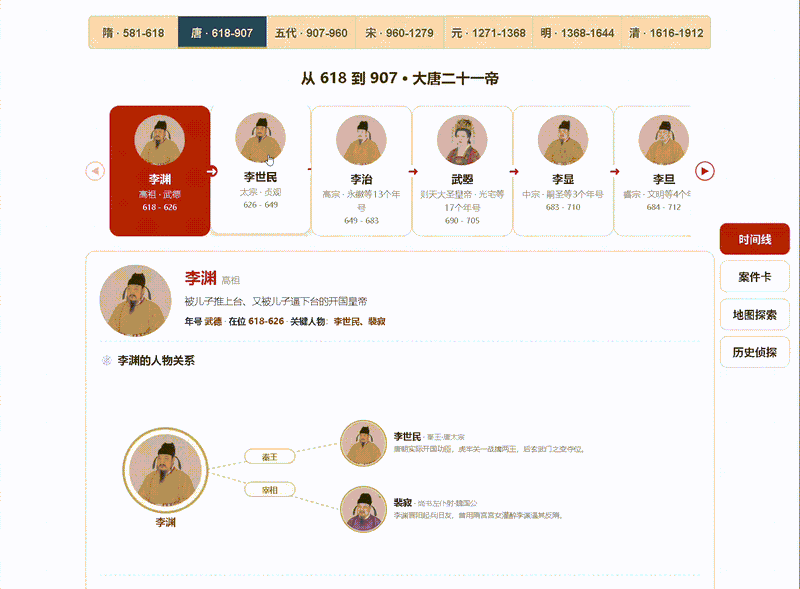
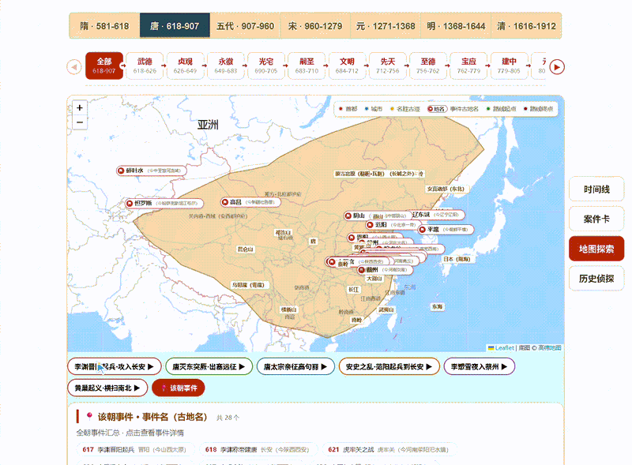
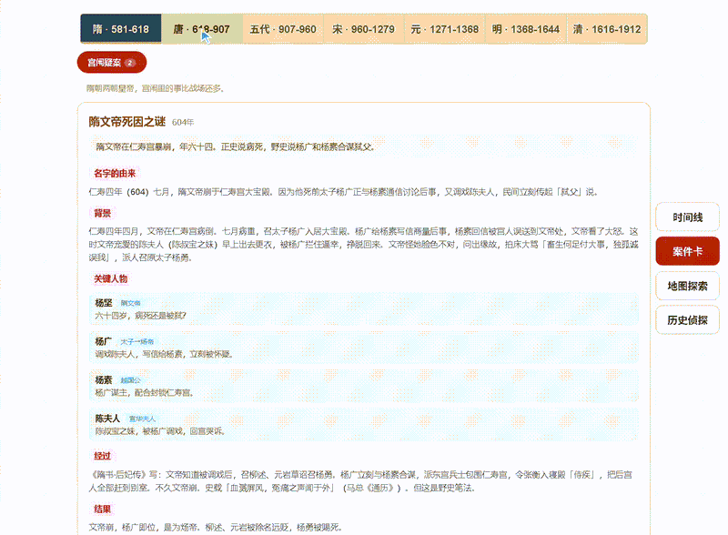
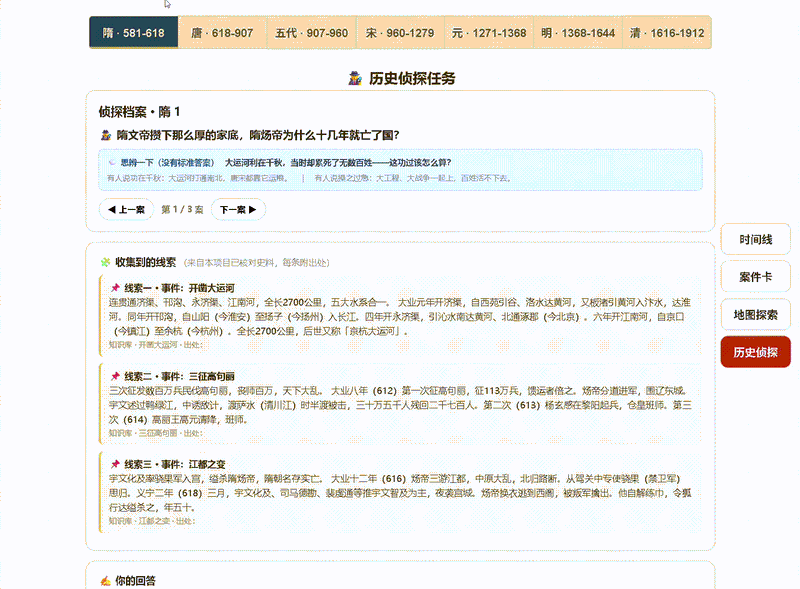

# 🏮 Chinese History Atlas

> English | [中文](README.md)

A visual, timeline-driven Chinese history learning site covering **seven dynasties: Sui · Tang · Five Dynasties and Ten Kingdoms · Song · Yuan · Ming · Qing**. Follow each emperor as the thread and events, people, maps, cases, and critical questions weave themselves together — you build the cause-and-effect story of *who did what, when, why, and what came of it*, instead of memorizing dates.

Great for history buffs who want to revisit the whole arc in one coherent thread, and for students who need a clean chronological framework.

**🌐 Live demo**:
- GitHub Pages: https://zinging.github.io/chinese-history-atlas/web/
- Gitee Pages: https://chen_ye_code.gitee.io/chinese-history-atlas/web/


---

## 🎬 Preview

**Emperor rail** — a horizontal card rail; open one for the life timeline, relationship graph, and fun facts



**Map explorer** — dynasty borders + ancient place markers + animated march / voyage routes



**Case files** — famous cases broken down: origin, course, outcome, impact, and sources



**History detective** — puzzle-style clue investigation with sourced leads, then write your own judgment



---

## ✨ Highlights

- **One timeline per dynasty.** A horizontal card rail of emperors; open one for the life timeline, relationship graph, fun facts, and controversies.
- **History on a map.** A pan/zoom Leaflet basemap overlays each dynasty's approximate borders and ancient place pins, with animated campaign and voyage routes (Zheng He's seven voyages, the Jingnan campaign, the Qing entry into Shanhai Pass, …).
- **Deep-read case files.** Famous mysteries (Jingnan, Lan Yu, Crow Terrace Poetry, Tumu Crisis, Battle of Yamen…) are broken into naming, background, people, course, outcome, impact, open debate, and sources.
- **Quiz workshop with 380 questions.** Built-in **multiple-choice questions for all 77 emperors** across two modes — evaluative judgment and causal chains. Answers are graded instantly with historical explanations; ~25% are open-ended and can be reviewed by an optional AI tutor.
- **Traceable claims.** Timeline entries and detective clues cite the *Old/New Book of Tang*, *History of Song*, *History of Ming*, etc.; fiction is labeled separately.
- **Zero dependencies, self-hostable.** Vanilla HTML/CSS/JS, no build, no framework, no backend; `data/` is plain readable JSON.
- **Bring your own AI tutor.** Any OpenAI-compatible endpoint (DeepSeek, OpenAI, …) can comment on your open-ended answers; the config stays on your machine.

---

## 🧭 How to learn with it

| Direction | What you can do |
| --- | --- |
| Build the big frame | Read the emperor rail across all seven dynasties to fix "Tang → Five Dynasties → Song" in your head |
| Understand key figures | Open any emperor to see the relationship graph (ministers, consorts, rivals) |
| Follow major events | On the map, filter by era and watch a battle/coup unfold from start to finish |
| Train historical thinking | Quiz workshop: each question asks both "how do you evaluate this?" and "what's the causal chain?" |
| Weigh historical debates | Read case files and open questions ("Would Chai Rong have recovered the Sixteen Prefectures?") |
| Practice source thinking | In History Detective, you get sourced clues first, then form your own judgment |
| Ancient ↔ modern places | Click any ancient place pin to see where it is today (e.g. Muzhou = around modern Jiande, Zhejiang) |

---

## 🚀 Quick start

**Requirement:** Node.js 18+ (built-in `fetch`; no `npm install` needed).

```bash
git clone git@gitee.com:chen_ye_code/chinese-history-atlas.git
cd chinese-history-atlas
node web/serve.mjs
# Open http://127.0.0.1:5173/web/ in your browser
```

> Port in use? `node web/serve.mjs 8080`, then open `http://127.0.0.1:8080/web/`.
>
> Why a local server? The frontend reads `../data/*.json` via `fetch`; opening it with `file://` is blocked by the browser's CORS policy and the page will be blank.

**Optional · AI tutor:** on the History Detective page, scroll to "🤖 AI Tutor config", enter any OpenAI-compatible endpoint + API key + model (click ⬇ to fetch the model list). The config lives only in `web/llm-config.json` (git-ignored). A commented `web/llm-config.json.template` is included — copy it to `llm-config.json` and fill it in.

---

## 🏗️ Project structure

```
chinese-history-atlas/
├── data/                  # Knowledge layer: seven dynasties of content (JSON)
│   ├── sui/ tang/ wudai/ song/ yuan/ ming/ qing/   # per-dynasty folders
│   │   ├── emperors/      # Emperor cards (life, timeline, people, fun facts)
│   │   ├── events/        # Major events of the dynasty
│   │   ├── cases/         # Case-file mysteries
│   │   ├── places/       # Ancient places (with modern equivalents, lat/lng)
│   │   ├── routes/        # Campaign / voyage routes
│   │   ├── quiz.json      # Quiz workshop question bank
│   │   └── people.json    # Key figure biographies
│   ├── boundaries/       # Dynasty territory GeoJSON
│   ├── portraits/        # Portraits (AI-generated gongbi style, 512×512)
│   ├── schema/ sources/    # Data schema and source citations
├── web/                   # Frontend: vanilla HTML/CSS/JS
│   ├── index.html app.js search-core.js serve.mjs
│   ├── tools/             # Quiz generation and validation scripts (quiz-lib.mjs, …)
│   └── vendor/            # Leaflet vendored locally, no CDN
├── scripts/               # Validators and maintenance scripts
└── docs/                  # Architecture / content guidelines / demos
```

---

## 📊 Data scale

| Dynasty | Emperors | Map events | Routes | Quiz questions |
| --- | --- | --- | --- | --- |
| Sui (581–618) | 3 | 8 | 3 | 17 |
| Tang (618–907) | 14 | 28 | 6 | 71 |
| Five Dynasties + Ten Kingdoms (907–960) | 6 (central plains) + Ten Kingdoms Gantt chart | 12 | 2 | 30 |
| Song (960–1279) | 18 | 14 | 4 | 91 |
| Yuan (1271–1368) | 8 | 14 | 5 | 33 |
| Ming (1368–1644) | 16 | 43 | 10 | 78 |
| Qing (1616–1912) | 12 | 22 | 6 | 60 |

**77 emperors, 380 quiz questions, 545 timeline entries**, each rewritten in plain language. Territory outlines are simplified sketches based on Tan Qixiang's *Historical Atlas of China*. 224 portraits compressed to 512×512.

---

## 🧪 Self-tests

```bash
node scripts/validate.mjs        # data validator
node web/smoke.mjs               # four-page render
node web/smoke-geo.mjs           # territory and route animation
node web/smoke-dynasties.mjs     # seven-dynasty map data layer
```

---

## 📖 Content guidelines

- **Sources first.** Only include what the historical record supports; mark gaps as "no reliable record"; label fiction/lore separately as "popular tale, not in official histories."
- **Plain language.** Short sentences; explain proper nouns on first mention (e.g. "the Sixteen Prefectures, roughly modern Beijing, Tianjin and northern Hebei/Shanxi").
- **Learner as director.** Open questions have no single answer — give the reader room to think before presenting the scholarly consensus. In multiple-choice questions, the correct option is shuffled across positions so answers can't be guessed by placement.

---

## 📄 License

[MIT License](LICENSE) © chen_ye_code

Content draws mainly from the official histories (*Book of Sui*, *Old/New Book of Tang*, *History of Song*, *History of Yuan*, *History of Ming*, *Draft History of Qing*, etc.). Territory outlines are hand-drawn simplified sketches, not precise boundaries. Portraits are AI-generated gongbi-style stylized images, not true historical likenesses. Map tiles © their respective providers; Leaflet © Leaflet Contributors.
